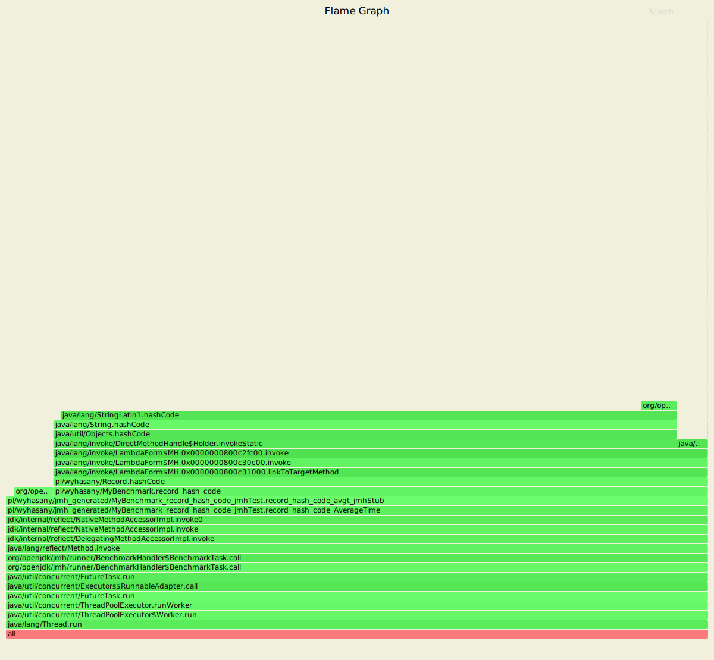

To run benchmark:

install and use Java 16 EA
```shell
sdk i java 16.ea.35-open
sdk u java 16.ea.35-open
```

Build and run benchmark
```shell
mvn clean verify
java --enable-preview -jar target/benchmarks.jar
```

First obtained results:
```
Benchmark                          Mode  Cnt    Score    Error  Units
MyBenchmark.base                   avgt    4    0.452 ±  0.174  ns/op
MyBenchmark.equals_record          avgt    4    4.342 ±  0.383  ns/op
MyBenchmark.equals_value           avgt    4    4.286 ±  0.463  ns/op
MyBenchmark.record_hash_code       avgt    4    3.032 ±  2.610  ns/op
MyBenchmark.record_to_string       avgt    4  836.982 ± 70.945  ns/op
MyBenchmark.value_class_to_string  avgt    4   18.554 ±  2.629  ns/op
MyBenchmark.value_hash_code        avgt    4    2.771 ±  2.094  ns/op
```

Another tests round:
```
Benchmark                                 Mode  Cnt    Score   Error  Units
MyBenchmark.base                          avgt    4    0,435 ± 0,360  ns/op
MyBenchmark.equals_record                 avgt    4    4,202 ± 1,476  ns/op
MyBenchmark.equals_value                  avgt    4    4,220 ± 1,477  ns/op
MyBenchmark.record_hash_code              avgt    4    4,152 ± 2,956  ns/op
MyBenchmark.record_to_string              avgt    4  640,983 ± 2,819  ns/op
MyBenchmark.value_class_to_string         avgt    4   14,779 ± 0,519  ns/op
MyBenchmark.value_hash_code               avgt    4    3,884 ± 2,971  ns/op
```

Why is so different? (Thanks to Krzysztof Ślusarski and Alexey Shipilëv)

Run benchmarks with async profiler:
```shell
java --enable-preview -jar target/benchmarks.jar -prof async:output=flamegraph
```

All flamegraphs you can find in `/flamegraphs` folder.

toString()
1. record

2. @Value


Record's `toString()` method is slower as it uses `String.format()` vs simple fast concatenation.

hashcode(): 
1. record

2. @Value

   
`@Value` is a little bit faster as it doesn't call lambdas